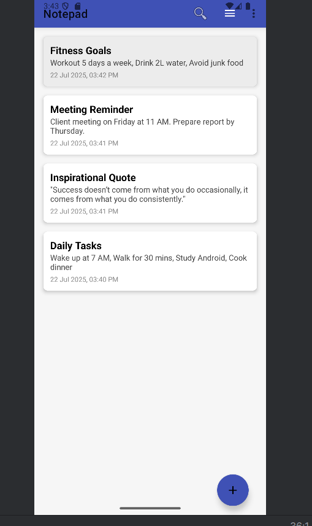
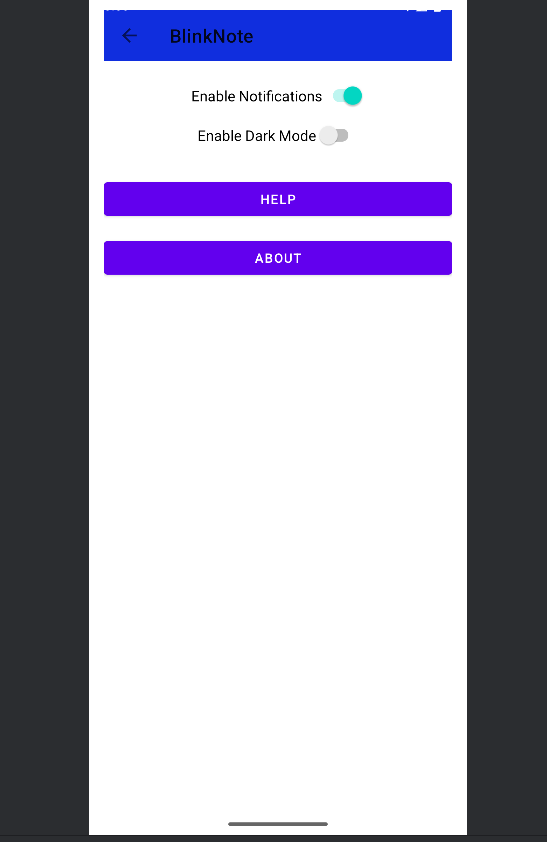
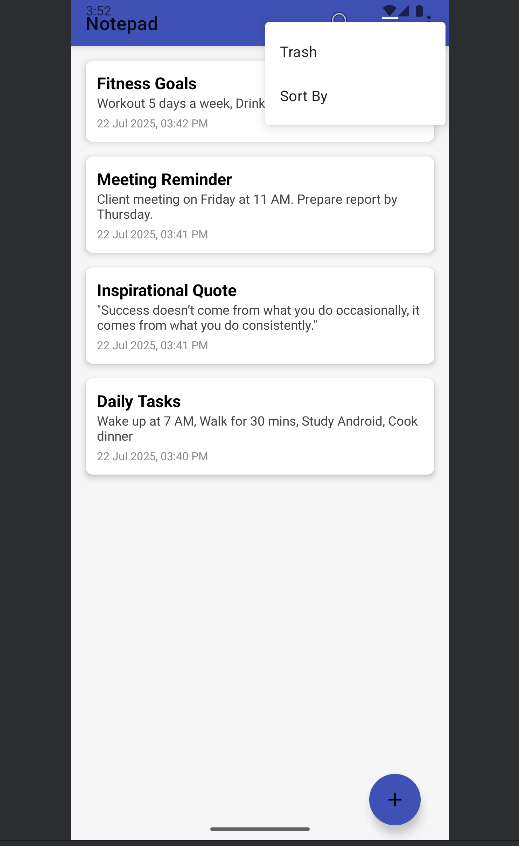

# 📝 BlinkNote - Your Smart Note Companion

BlinkNote is a beautifully designed Android note-taking app created as a mini project. It allows you to create, edit, delete, and organize notes with a modern, smooth UI experience.

---

## ✨ Features

- 📋 **Add, Edit, Delete Notes**
- 🗑️ **Trash Feature** – Restore or permanently delete notes
- 🔍 **Search Notes** by title or description
- 📅 **Date & Time Tracking** for each note
- 🧠 **Sort Options** – Newest, Oldest, A–Z, Z–A
- 🎨 Clean and intuitive Material Design UI
- 🚀 Fast, lightweight, and fully offline

---

## 📱 Screenshots

  
  
   
  
  
  
  

---

## 📂 Folder Structure

├── app
│ ├── src
│ │ ├── main
│ │ │ ├── java/com/example/firstdemoactivity/
│ │ │ ├── res/layout/
│ │ │ ├── res/drawable/
│ │ │ └── AndroidManifest.xml

---

## 🛠️ Built With

- **Java** (Android SDK 33.0)
- **XML** (UI Layouts)
- **Android Studio**
- **SharedPreferences** (for local storage)
- **Material Design Components**

---

## 🚧 Upcoming Features

- 🔔 Set Reminder Notifications
- 📦 Cloud Backup with Firebase
- 🌈 Note Color Categories

---

## 🤝 Contributing

Pull requests are welcome! If you'd like to improve the app, feel free to fork and submit a PR.

---

## 📃 License

This project is open-source and available under the [MIT License](LICENSE).

---

## 🙋‍♀️ Developer

Made with ❤️ by **Shivani Jijaba Thombare**  
📧 [shivanithombare25@gmail.com](mailto:shivanithombare25@gmail.com)

---
